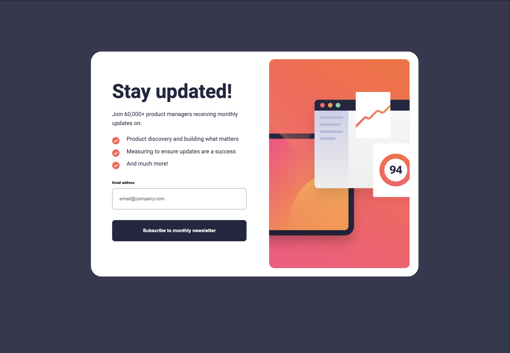
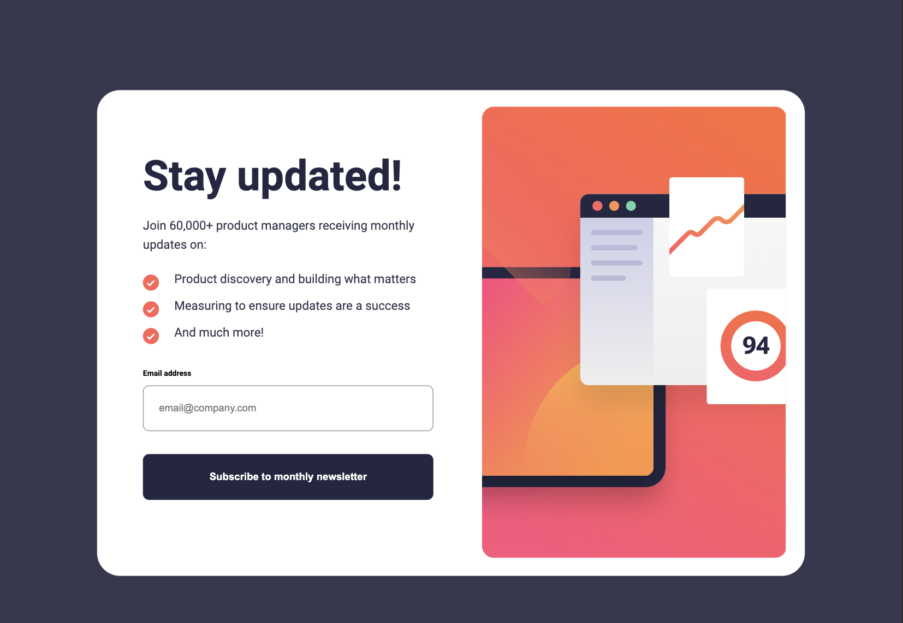
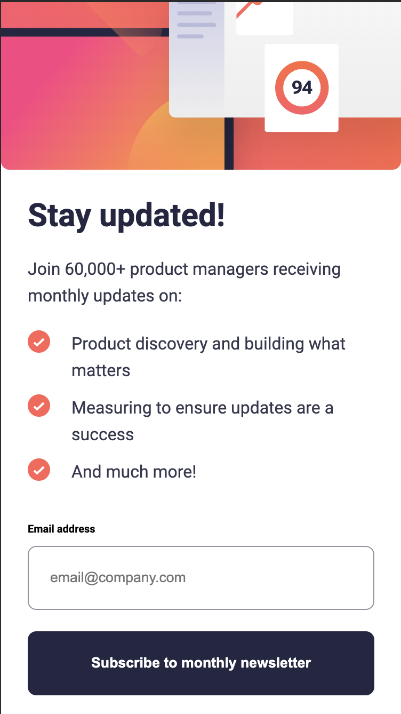
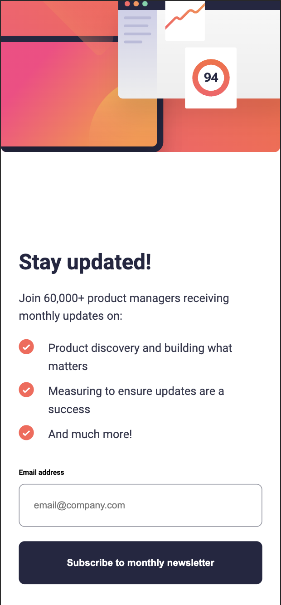
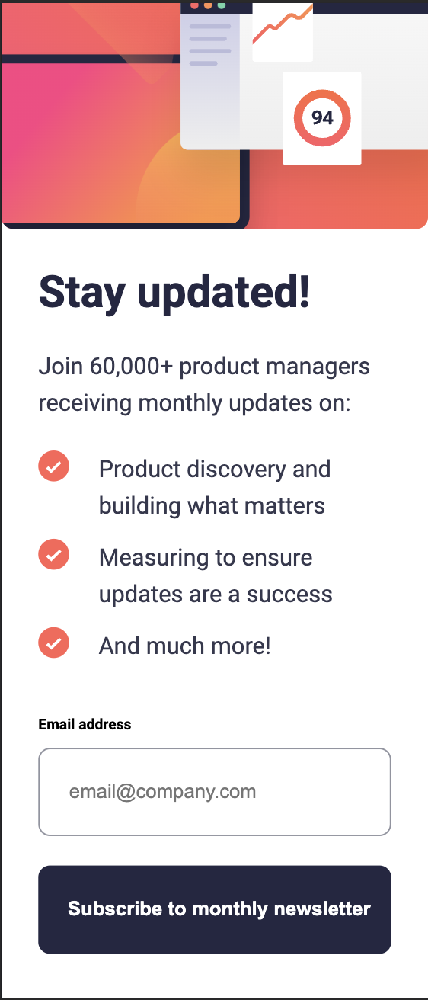

# Frontend Mentor - Newsletter sign-up form with success message solution

This is a solution to the [Newsletter sign-up form with success message challenge on Frontend Mentor](https://www.frontendmentor.io/challenges/newsletter-signup-form-with-success-message-3FC1AZbNrv). Frontend Mentor challenges help you improve your coding skills by building realistic projects.

- Live Site URL: [GitHub Pages Deployment here](https://mariariosnavarro.github.io/newsletter-sign-up/)

## Table of contents

- [Overview](#overview)
  - [The challenge](#the-challenge)
  - [Screenshot](#screenshot)
- [My process](#my-process)
  - [Built with](#built-with)
  - [Useful resources](#useful-resources)
- [Author](#author)

**Note: Delete this note and update the table of contents based on what sections you keep.**

## Overview

### The challenge

Users should be able to:

- Add their email and submit the form
- See a success message with their email after successfully submitting the form
- See form validation messages if:
  - The field is left empty
  - The email address is not formatted correctly
- View the optimal layout for the interface depending on their device's screen size
- See hover and focus states for all interactive elements on the page

### Screenshot

# Desktop

# iPad & Small Desktop

# Mobile (IphoneXR, Iphone12pro, Galaxy Fold)

## My process

### Built with

- Semantic HTML5 markup
- SCSS
- Javascript

### Useful resources

- [codelessly](https://codelessly.com/) - To analice the Design without Figma Design
- [my JS cheatsheet](https://mariariosnavarro.github.io/jssheet/) - My own cheatsheet

## Author

- Maria Rios Navarro
- Frontend Mentor - [@MariaRiosNavarro](https://www.frontendmentor.io/profile/MariaRiosNavarro)
